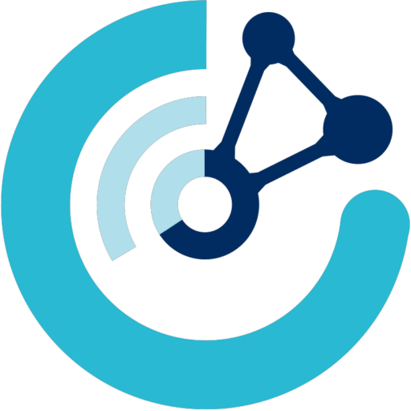

- 👋 Hi, I’m Pavel (and that is my actual brain)
- 🎓 MSc in Medical Neuroscience + Software Engineering at SoftUni
- 🧠 Brain-Computer Interfaces enthusiast
- 📩 pavel.syarov@charite.de

### 🐍 Languages

### 🛠️ Tools

